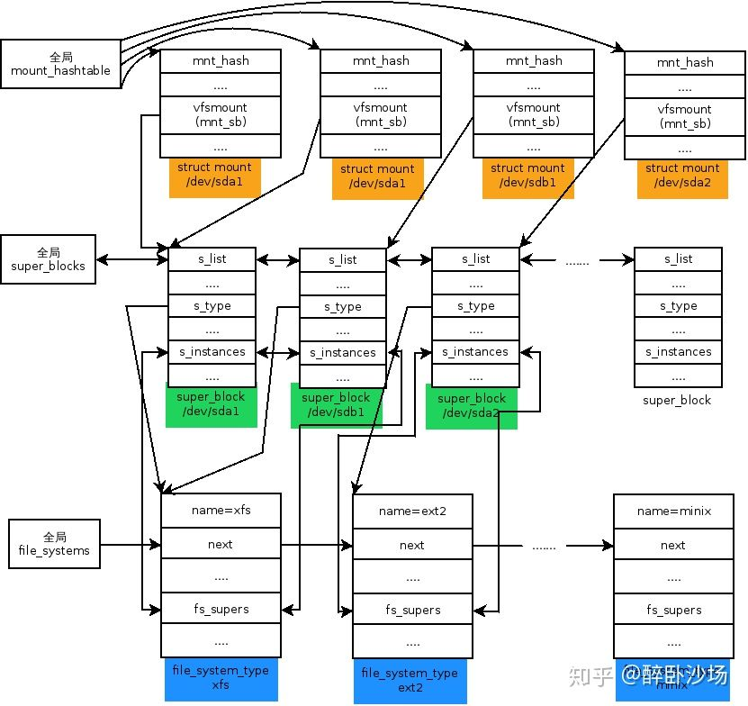
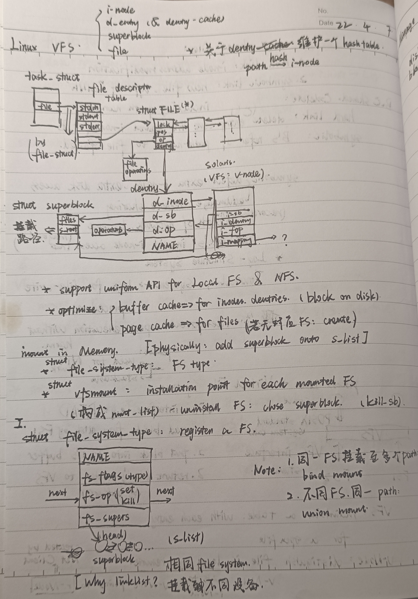
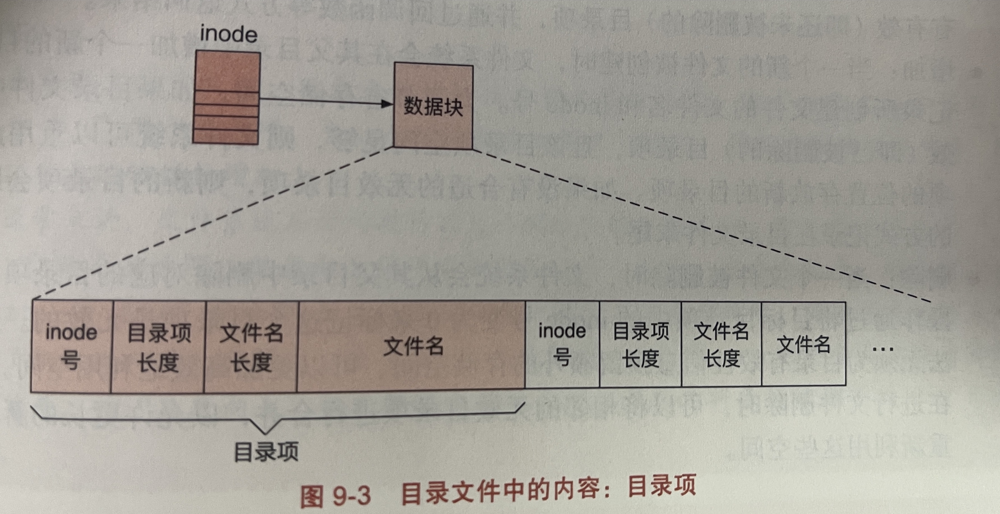
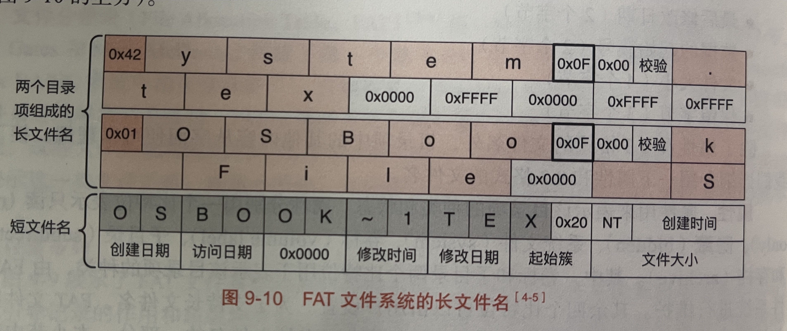

## Linux  VFS

### Relationships between Structs

- 4 major struct: `i-node, dentry, superblock, file`

0. How to access a file opened by an active process?
   - `task_struct -> file_struct -> file_descriptor_table -> (struct)file ` 
1. `struct file`: mutexes, position pointer(for r/w), operations(function pointers), `(struct) dentry`, etc
   - All file opened on current disk partition constructs a double-linked list. List head is recorded by `(struct) superblock`.
2. `struct dentry` (or dentry_cache, whatever): 
   - Namely 'dentry_cache'. Each dentry item is a hash from directory path `d_name` to i-node pointer `d_inode`.
   - Each index request sent from VFS to Real File System would create a `dentry` object, to make future path visit faster.
   - `d_sb` points to `(struct) superblock`
3. `struct superblock`
   - `s_root` record the mount path. (Path def is in **Mount.2.**)
4. `struct inode`
   - `i_sb` points to `(struct) superblock`, `i_dentry` points to `(struct)dentry` (it's impossible to be `NULL` !)
   - `i_mapping` points to the `(struct) address_space` object for the owner of the page that contains the `inode` data.

### Mount

0. `struct file_system_type`

   - For all mounted File Systems, their types are recorded by `struct file_system_type`, which constructs a linked list with head named `file_systems` by `next`.

   - Created by `register_filesystem()`.

   - `const char *NAME`: e.g. ext4, ISO9660, ...

   - `fs_op`: set filesystem or kill, or...

   - `fs_supers`: header of `(struct) superblock` objects link-list (`s_list`).

   - Why we need `s_list`? 

     System could mount many devices. Dev A and dev B maybe have same File System type. Both A's superblock and B's superblock are added into `fs_supers`.

1. What does Mount operation do? 

   - Read to-be-mounted File System's superblock group to create `(struct) mount`object, get `vfsmount`member.
   - Add `vfsmount` object onto mount tree.

   - Add a `(struct) superblock` object into `fs_supers` object and initialized it.

2. What is a path?

   ```c
   struct mount {
       ... ...
       struct mount *mnt_parent;
       struct vfsmount mnt;
       ... ...
   };
   
   struct vfsmount {
       struct dentry  *mnt_root;          
       struct super_block *mnt_sb; // superblock       
   };
   
   struct path {
       struct vfsmount *mnt;
       struct dentry *dentry;
   };
   ```

3. others

   - Single File System mounted onto multiple PATH: bind mount
   - Multi File System mounted onto same PATH without overlap: union mount
   
4. supply picture reading: 

   

## Handout Draft




## NOTE

- More details about `file_descriptor_table` are in SEC. 10.6 - P789-790.

- More details about `i_mapping`... If you know, please contact and teach me.
- More details about **mount** syscall: https://zhuanlan.zhihu.com/p/76419740.


## Remove a file
### Three steps
 1. Remove file from its directory
 2. Release i-node to the pool of free
 3. Return all disk blocks to pool of free disks blocks

### System Crush
 - aftre step 1 : the inode and block will not be avaliable able for reassignment
 - after step 2 : the block lost

### Wrong Order
 - in order 2 -> 3 -> 1: \
    crush after 2 , the inode is released and then be reassigned , the old file directory entry still point to the inode
 - in order 3 -> 1 -> 2: \
    crush after 3 , the block is released , but more than two files may use the same block

## Shared File:

### Hard Link : 
- different file ——— the same i-node 
- only the same file system

### Soft Link / Symbolic Link :
- path 
- in different file system

### Link count:
- Create a hard link , the link count increases ; remove one file , the link count decreases and delete the directory entry, when the link count is 0 , then release the inode. 
- Create a soft link , the link count does not change , when the file owner is removed , release the inode. 


## 文件操作（File Operations）

> 注意是文件操作而不是文件系统操作

- ``Create()``创建文件
- ``Delete()``删除文件
- ``Open()``打开文件
- ``Close()``关闭文件
- ``Read()``读文件
- ``Write()``写文件
- ``Append()``追加写入文件
- ``Seek()``移动读写指针位置
- ``Get attributes()``获取文件属性
- ``Set attributes()``设置文件属性
- ``Rename()``文件重命名

## 目录树/目录系统 (Directory Systems)

- **只有唯一的根目录(root directory)**
- 事实上文件系统只是很多文件抽象的集合,为了方便用户管理文件才针对文件的某些属性(比如文件名或路径)引入目录来进行抽象,文件名对于文件不是必要的.基于人们习惯才用文件名来管理文件.
- 目录在NTFS(windows)中是以文件夹的形式展示给用户的

### 目录操作

- ``Create()``创建目录
- ``Delete()``删除目录
- ``Opendir()``打开目录
- ``Closedir()``关闭目录
- ``Readdir()``读取目录
- ``Rename()``目录重命名
- ``Link()``创建硬链接
- ``symlink()``创建符号链接
- ``unlink()``删除硬链接或符号链接

### 目录实现

- 目录是一种特殊类型的文件,同样存放在数据块(block)中

- 通常一个目录文件中存放着多个目录项 

- 每个目录项中存放:

  - inode 号
  - 目录项长度
  - 文件名长度
  - 文件名

- 目录项一个接一个地存放在目录文件所在的数据块中,组成连续的字符序列,从而可以直接复用常规文件的数据组织方式

- 

-  目录项中文件名的实现:

  - 这里以 FAT32 为例
  - FAT32 中每个目录项大小为 32 字节,其中 11 个字节分配给 8.3 格式的文件名
  - 下面介绍 8.3 格式的文件名:
    - 短文件名:占用 11 个字节,前 8 个字节为文件名,后 3 个字节为拓展名
      - datafile.dat 会被存为 DATAFILEDAT
      - mydatafile.dat 会被存为 MYDATA~1DAT: ~表示截断,1表示这是第一个此类文件,即 MYDATA~中第一个
      - 8.3 格式不支持小写字母
    - 长文件名:在保留短文件名的同时,用多个额外的目录项来保存长文件名
      - 组织的形式为线性组织,长文件名的目录项会放在相应短文件名目录项前
      - FAT32 限制文件名长度不超过 255
      - 
  - 课上还讲了用堆(heap)和指针的方式来组织长文件名

  #### 参考文献:《现代操作系统原理与实现》 陈海波
