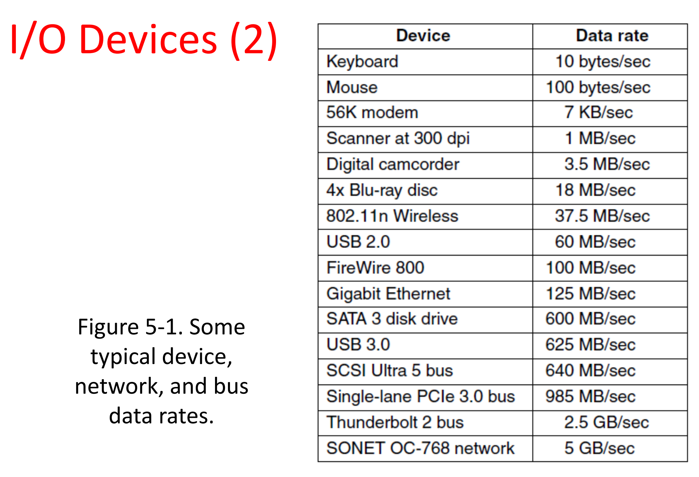
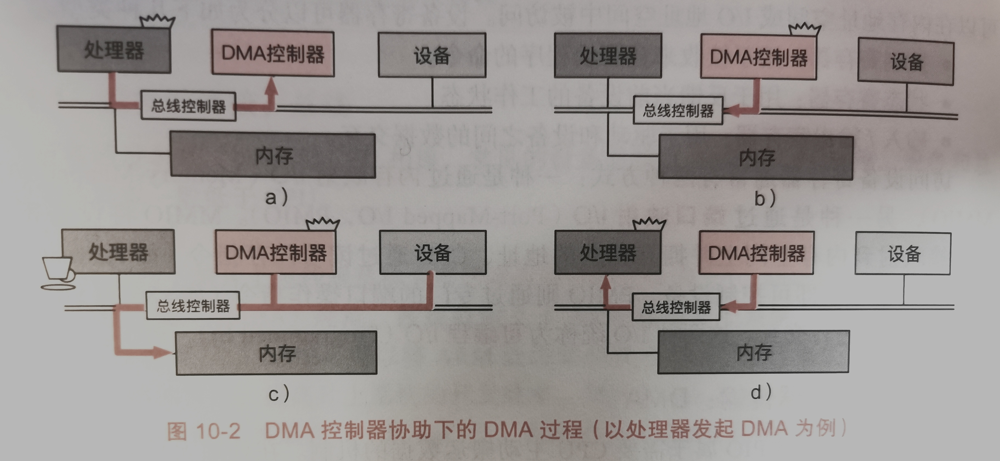

## 计算机设备的连接和通信
 

### 设备的连接：总线

设备通过总线（bus）和CPU相连，常见设备总线有AMBA、PCIe等，设备和总线的工作频率一般低于CPU。

#### AMBA总线
ARM架构下的片上总线规范为高级微控制器结构（Advanced Micro-controller Bus Architecture, AMBA）规范，该规范定义了ARM架构片上系统（System-on-Chip，Soc）的通信标准。  

在AMBA规范中一共包括三组总线：  
**高级高性能总线**（Advanced High-Performance Bus，AHB）：用于连接其他高性能IP核，片上和片外内存以及中断控制器等高性能模块  
**高级系统总线**（Advanced System Bus，ASB）：用于某些不必使用AHB但同时又需要高性能特性的芯片中，能起到一部分降低功耗的作用  
**高级设备总线**（Advanced Peripheral Bus，APB）：用于连接低速的设备，作为低功耗的精简接口总线  

#### PCI总线
除了AMBA之外，还有一类常用的设备总线标准——设备组件互连（Peripheral Component Interconnect，PCI）标准。任何厂商生产的设备只要符合PCI规范，都能通过PCI插槽和CPU进行通信。  
数据传输速率过高时，PCI所采用的并行线路间会相互干扰。PCIe（PCI express）使用了基于数据包的串行连接协议，其相比于PCI总线来说带宽更高，同时保持了PCI设备驱动的前向兼容性

### I/O Device
**Block Devices**:  

 Stores information in fixed-size blocks  
 Transfers are in units of entire blocks
 
**Character devices**:  

 Delivers or accepts stream of characters, without 
regard to block   
 Not addressable, does not have any seek
operation

### 可编程I/O

CPU通常以读写设备寄存器的方式与设备进行通信。一个设备通常有多个寄存器：可以在内存地址空间或I/O地址空间中被访问。设备寄存器可以分为如下几种类型。  
**控制寄存器**：用于接收来自驱动程序的命令  
**状态寄存器**：用于反馈当前设备的工作状态  
**输入/输出寄存器**：用于驱动和设备之间的数据交互  

访问设备寄存器通常有两种方式，一种是通过内存映射I/O（Memory-Mapped I/O, MMIO），另一种是通过端口映射I/O（Port-Mapped I/O， PMIO）。MMIO将设备寄存器直接映射到内存空间上并拥有独立的地址，CPU通过读写内存指令（如AArch64分ldr/str指令）即可控制设备。PMIO则通过专门的端口操作指令（如x86的in/out指令）和设备进行交互。这两种I/O统称为可编程I/O（Programmed I/O， PIO）。

#### PMIO和MMIO的主要区别
1）前者不占用CPU的物理地址空间，后者占有（这是对x86架构说的，一些架构，如IA64，port I/O占用物理地址空间）。  
2）前者是顺序访问。也就是说在一条I/O指令完成前，下一条指令不会执行。例如通过Port I/O对设备发起了操作，造成了设备寄存器状态变化，这个变化在下一条指令执行前生效。uncache的MMIO通过uncahce memory的特性保证顺序性。  
3）使用方式不同。  
由于port I/O有独立的64K I/O地址空间，但CPU的地址线只有一套，所以必须区分地址属于物理地址空间还是I/O地址空间。

### 高效传输数据：DMA
在现代计算机系统中，直接内存访问(Diret Memory Access, DMA) 是在设备和内存之间主要且更高效的数据传送形式。与PIO 不同，DMA机制允许设备绕过处理器直接读写系统内存的数据。设备传输数据的同时，处理器可以进行其他任务。由此可见，DMA提高了处理器资源的利用率。

DMA的发起者可以是处理器，也可以是I/O设备。以处理器发起DMA为例，设备驱动首先在内存中分配一块DMA缓冲区，随后发起DMA请求，设备收到请求后通过DMA机制将数据传输至DMA缓冲区。DMA操作完成后，设备触发中断通知处理器对DMA缓冲区中的数据进行处理。

在一些总线中，DMA的发起还需要DMA控制器的参与。DMA控制器和处理器与内存连接到同一系统总线(system bus),因为DMA控制器相当于收发双方(处理器和设备)的第三方，因此这种机制被称为第三方DMA (third-party DMA),也被称为标准DMA。在标准DMA场景下由处理器发起DMA的具体步骤如下:

1.处理器向DMA控制器发送DMA缓冲区的位置和长度，以及数据传输的方向，随后放弃对总线的控制;  
2.DMA控制器获得总线控制权，可以直接与内存和设备进行通信;  
3.DMA控制器根据从处理器获得的指令，将设备的数据拷贝至内存，在这期间处理器可以执行其他任务;  
4.DMA控制器完成DMA后向处理器发送中断，通知处理器DMA已经完成。此时，处理器会重新得到总线的控制权。

另一种情况是由设备发起DMA,设备首先通知DMA控制器，并由DMA控制器向总线控制器申请占用总线，此后的流程与处理器发起DMA的情况相似。

不少总线允许设备直接获取总线控制权并进行DMA操作，而无须借助DMA控制器，这种机制被称为第一方DMA (first-party DMA),也称为总线控制(bus mastering)。可以理解为将DMA控制器的角色和设备的角色合二为一，不过，如果多个设备希望同时进行DMA, 总线控制器需要进行仲裁，决定优先次序，同一时间只允许一个设备进行DMA。

### 设备的中断处理
由于CPU不知道设备的状态，所以需要不断轮询设备的状态寄存器来判断是否可以进行下一个操作，而重复轮询的缺点就是效率低下，浪费CPU的时钟周期。解决这一问题的关键是引人中断(interrupt)，让设备主动告知CPU一个外部事件的发生。为了响应中断，操作系统需要实现一套处理逻辑，即中断处理函数(IRQ handler)。

#### 中断类型
以ARMv8的中断控制器，通用中断控制器（Generic Interrupt Controller， GIC）为例，GIC的中断类型可以分为三类：  

**软件生成中断**( Software Generated Interrupt, SGI):由软件通过写GICD_ SGIR系统寄存器触发，常用于发送核间中断。  
**私有设备中断**( Private Peripheral Interrupt, PPI): 由每个处理器核上私有的设备触发，如通用定时器(Generic Timer)。  
**共享设备中断**( Shared Peripheral Interrupt, SPI): 由所有CPU核心共同连接的设备触发，可以发送给任意核心。

#### 中断优先级
根据中断事件的重要程度和紧迫程度，GIC 允许操作系统为中断配置不同的中断优先级。通常优先级的数字越小表示优先级越高。在中断仲裁时，高优先级的中断会先于低优先级的中断被发送给CPU处理。当CPU在响应低优先级中断时，如果此时有高优先级中断到来，那么高优先级中断会抢占低优先级中断，被CPU优先响应  

#### 中断状态

GIC中的每个中断都存在如下四种状态：

**Inactive**：中断处于无效状态，此时没有中断到来。  
**Pending**：中断处于有效状态，此时中断已经发生，但CPU没有响应中断。  
**Active**：CPU处于响应并处理中断的过程中。  
**Active & Pending**：在CPU响应并处理中断的过程中，同时又有相同中断号的中断发生

## 中断控制

### 中断

优先处理紧急突发事件。

### 中断控制器

外部设备产生的中断事件不会直接通过INTR总线进入CPU，而是先发送给中断控制器，中断控制器再转交给CPU。

作用：减少CPU的负载，让CPU更加专注于计算。

工作流程：

* 外设发送中断请求到控制器
* 控制器向CPU发送中断
* CPU确认中断

### 精确中断

PC前的指令完全执行，PC后的指令完全未执行。

## 驱动

### IO软件的目的

* 设备无关
* 统一命名
* 错误处理
* 同步/异步
* 缓冲

### 编程IO

先从用户空间获取数据，内核空间逐步发送给设备，发送时一直处于内核空间。

#### 例：向打印机发送字符串

每发送一个字符进入循环暴力等待打印机READY信号。

### 基于中断的IO

收到中断后向设备发送内容，然后退出中断。

### 基于DMA的IO

只需要拷贝内容+初始化DMA控制器

### IO软件分层

* 用户态IO软件
* 设备无关系统软件
* 设备驱动程序
* 中断处理器
* 硬件

### 处理中断的流程

1. 保存未被中断硬件保存的寄存器
2. 准备中断服务上下文
3. 准备中断服务栈
4. 向中断控制器发送确认，如果没有集中中断控制器，再使能中断
5. 从保存的进程表里拷贝寄存器
6. 运行中断服务过程
7. 选择下一个要运行进程
8. 为下一个要运行的进程准备MMU上下文
9. 加载新进程的寄存器，包括程序状空间寄存器
10. 开始运行新的进程

### 设备驱动

逻辑位置：硬件控制器之上，操作系统其它部分之下。

### 设备无关IO冠军

* 设备驱动同等抽象
* 缓冲
* 错误报告
* 分配和释放外接设备
* 提供设备无关的块大小

### 缓冲

无缓冲
用户空间缓冲
内核空间缓冲
内核双缓冲

例：网络需要很多缓冲

### 用户空间IO软件

用户程序
设备无关软件
设备驱动
中断处理器
硬件
不同层的关联

